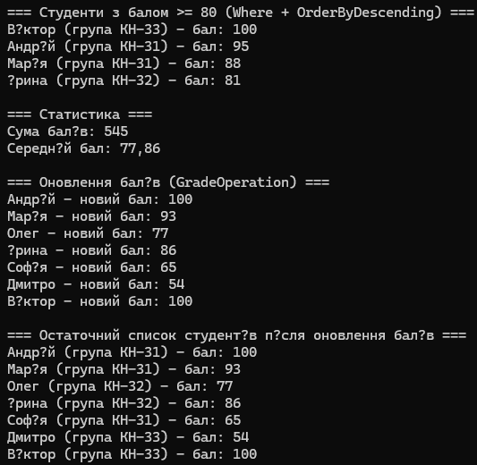

# Лабораторна робота №6  
## Тема: Лямбда-вирази, анонімні методи та делегати у C#  
## Варіант 2 — Student  
(файл з завдання: ООП - Лабораторна робота №6.pdf) :contentReference[oaicite:0]{index=0}

###  Реалізовано:
- Клас **Student (ім’я, оцінка, група)**  
- Власні делегати:
  - `StudentCondition`
  - `GradeOperation`
- **Анонімний метод** для перевірки відмінників  
- **Лямбда-вирази** для фільтрації студентів  
- **Predicate<Student>** — вибір студентів із балом >80  
- **Func<Student, string>** — формування текстового звіту  
- **Action<Student>** — вивід у консоль  
- **LINQ**:
  - Where  
  - Select  
  - OrderByDescending  
  - Aggregate  
  - Average  

###  Сценарії:
- Вибір студентів за різними критеріями  
- Побудова текстових звітів  
- Оновлення оцінок через делегати  
- Обчислення статистики (сума, середнє значення)

###  Технології:
- Делегати (власні + стандартні)  
- Анонімні методи та лямбда-вирази  
- LINQ  
- Списки List<T>  
- Консольний вивід  

### Вивід в консоль:
 

###  Висновок:
Отримано практичні навички роботи з делегатами, анонімними методами, лямбда-виразами та LINQ.  
Реалізовано повну обробку колекції студентів із використанням функціональних можливостей C#.
